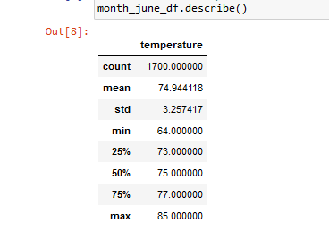
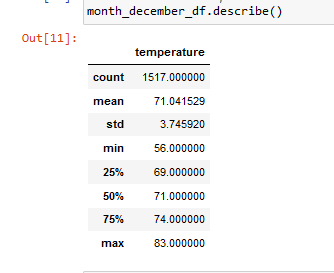

# Surfs_Up
# Overview of Project
Many businesses get started with the help investors.  In this module, we were tasked with running some analytics on a weather data set from the island of Awahoo.  The information was to be included in the business plan for a Surf and Shake shop.  The business plan was presented to a potential investor called W.Avy.  However, more information is required before W.Avy can make a final decision. 

## *Purpose* 
The purpose of this project is to obtain temperature data for the months of June and December in Oahu, in order to determine if the surf and ice cream shop business is sustainable year-round.

# Results
For this challenge, summary statistics for the month of June and December were created using SQLAlchemy, Python, and Pandas. Figure 1 shows a side-by-side comparison of the summary statistics for the month of June and December. 

## *Figure 1*

  

Based on the summary statistics in Figure 1, there are three key differences in weather between June and December.

        1. December has a lower mean, but the max is almost the same as June 
        2. December is about 3 degrees colder on average, but the min temp is 8 degrees colder. 
        3.There is 200 less data points in December

# Summary
Overall, there is not a huge difference in temperature for the two months. More data can be provided.  Some additional queries that could provide other key information are queries for the humidity levels and rain patterns.  